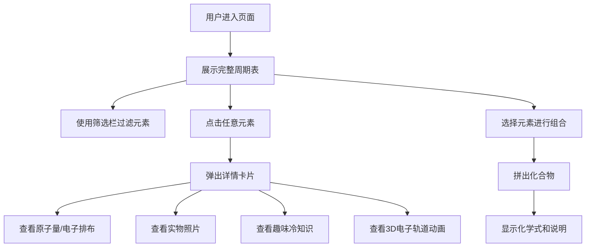

## 1. 产品概述

一个交互式元素周期表探索工具，将枯燥的化学元素知识转化为生动有趣的学习体验。用户可以通过彩色可视化周期表浏览118个元素，点击查看详细信息，并通过筛选和组合功能深入探索化学世界。

- 面向学生、化学爱好者和教育工作者
- 解决传统周期表学习枯燥、信息单一的痛点
- 通过趣味知识、实物照片和互动组合功能激发学习兴趣

## 2. 核心功能

### 2.1 功能模块

1. **周期表主页**：标准布局的元素周期表、筛选栏、化合物组合区域
2. **元素详情弹窗**：展示元素的全方位信息

### 2.2 页面详情

| 页面名称 | 模块名称 | 功能描述 |
|-----------|-------------|---------------------|
| 周期表主页 | 周期表网格 | 按标准IUPAC布局展示118个元素，CSS Grid实现，按分类着色，显示符号和原子序数 |
| 周期表主页 | 筛选栏 | 按金属/非金属/状态等分类筛选，高亮或隐藏元素 |
| 周期表主页 | 化合物组合区 | 选择元素拼出常见化合物，显示组合结果 |
| 元素详情弹窗 | 基本信息区 | 原子量、电子排布、元素分类、物理状态 |
| 元素详情弹窗 | 发现历史 | 发现年份、发现者、命名来源 |
| 元素详情弹窗 | 实物照片 | 元素的真实图片展示 |
| 元素详情弹窗 | 趣味冷知识 | 有趣的化学小知识和应用场景 |
| 元素详情弹窗 | 3D电子轨道 | 可视化电子云分布（CSS动画实现） |

## 3. 核心流程

用户打开页面 → 浏览彩色周期表 → 使用筛选器按分类探索 → 点击元素查看详情（含照片和趣味知识）→ 选择元素组合化合物 → 查看组合结果和化学式

## 4. 用户界面设计

### 4.1 设计风格

- **整体风格**：现代科技感 + 教育趣味，深色主题配合荧光色彩
- **主色调**：深空蓝 (#0a0e27) 作为背景，营造宇宙感
- **分类配色**：
  - 碱金属：#ff6b6b（温暖橙红）
  - 碱土金属：#ffa94d（明亮橙黄）
  - 过渡金属：#ffd43b（金黄）
  - 贫金属：#69db7c（嫩绿）
  - 准金属：#38d9a9（青绿）
  - 非金属：#4dabf7（天蓝）
  - 卤素：#748ffc（靛蓝）
  - 稀有气体：#da77f2（紫色）
  - 镧系元素：#f783ac（粉红）
  - 锕系元素：#e599f7（淡紫）
- **按钮风格**：圆角胶囊按钮，hover时有发光效果
- **字体**：标题使用 Orbitron（科技感字体），正文使用 Noto Sans SC
- **布局风格**：卡片式设计，毛玻璃效果（backdrop-blur）
- **动画**：元素hover发光、弹窗出现缩放+淡入、电子轨道旋转动画

### 4.2 页面设计概述

| 页面名称 | 模块名称 | UI元素 |
|-----------|-------------|-------------|
| 周期表主页 | 头部标题 | 大标题、副标题、深色渐变背景、发光文字效果 |
| 周期表主页 | 筛选栏 | 胶囊按钮组、多选标签、当前筛选状态提示 |
| 周期表主页 | 周期表网格 | 18×10 CSS Grid、元素卡片、悬停放大发光、分类色边框 |
| 周期表主页 | 化合物组合区 | 已选元素展示区、清除按钮、结果展示卡片 |
| 元素详情弹窗 | 整体容器 | 毛玻璃背景、圆角边框、淡入缩放动画、关闭按钮 |
| 元素详情弹窗 | 头部 | 大号元素符号、原子序数、中文名、分类色标签 |
| 元素详情弹窗 | 信息网格 | 原子量、电子排布、状态、发现年份等信息卡片 |
| 元素详情弹窗 | 照片区 | 元素实物图、圆角、阴影 |
| 元素详情弹窗 | 趣味知识 | 引用样式卡片、图标装饰 |
| 元素详情弹窗 | 电子轨道 | 同心圆动画、电子点旋转、CSS动画 |

### 4.3 响应式

- 桌面端优先设计（≥1280px）
- 平板端（768-1279px）：周期表缩放显示，弹窗居中
- 移动端（<768px）：周期表可横向滚动，弹窗全屏展示

### 4.4 3D场景 Guidance（电子轨道可视化）

- **环境**：深色背景模拟原子核外空间
- **灯光**：柔和的内发光营造电子云辉光
- **相机**：固定正视角
- **构图**：原子核居中，电子轨道同心圆环绕
- **交互**：CSS动画实现电子沿轨道旋转
- **后处理**：模糊和透明度模拟电子云效果
