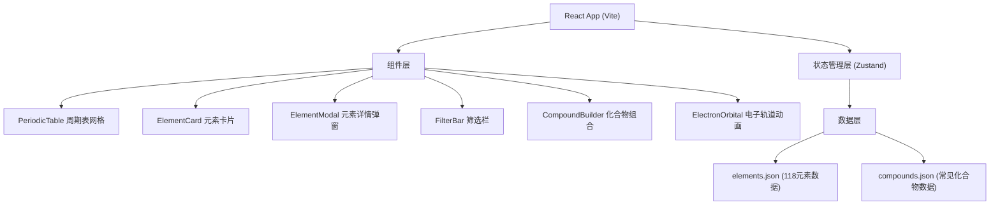

## 1. 架构设计



## 2. 技术描述

- **前端**：React@18 + TypeScript + Vite@5 + TailwindCSS@3 + Zustand
- **初始化工具**：vite-init
- **后端**：无（纯前端静态应用）
- **数据库**：无（JSON文件作为数据源）
- **图标库**：lucide-react

## 3. 路由定义

| 路由 | 用途 |
|-------|---------|
| / | 主页（周期表 + 筛选 + 组合功能） |

单页应用，无需路由切换。

## 4. 数据模型

### 4.1 元素数据模型

```typescript
interface Element {
  atomicNumber: number;          // 原子序数
  symbol: string;                // 元素符号
  name: string;                  // 英文名
  chineseName: string;           // 中文名
  atomicMass: number;            // 原子量
  category: ElementCategory;     // 元素分类
  group: number | null;          // 族 (1-18)
  period: number;                // 周期 (1-7)
  block: string;                 // 区 (s/p/d/f)
  electronConfiguration: string; // 电子排布
  shells: number[];              // 各层电子数
  stateAtSTP: ElementState;      // 标准状态
  meltingPoint: number | null;   // 熔点 (K)
  boilingPoint: number | null;   // 沸点 (K)
  density: number | null;        // 密度 (g/cm³)
  discoveredBy: string;          // 发现者
  discoveryYear: number | null;  // 发现年份
  namedAfter: string;            // 命名来源
  imageUrl: string;              // 实物图片URL
  funFact: string;               // 趣味冷知识
  uses: string[];                // 主要用途
}

type ElementCategory = 
  | 'alkali-metal'      // 碱金属
  | 'alkaline-earth'    // 碱土金属
  | 'transition-metal'  // 过渡金属
  | 'post-transition'   // 贫金属
  | 'metalloid'         // 准金属
  | 'nonmetal'          // 非金属
  | 'halogen'           // 卤素
  | 'noble-gas'         // 稀有气体
  | 'lanthanide'        // 镧系元素
  | 'actinide';         // 锕系元素

type ElementState = 'solid' | 'liquid' | 'gas' | 'unknown';
```

### 4.2 化合物数据模型

```typescript
interface Compound {
  formula: string;              // 化学式
  name: string;                 // 中文名
  elements: string[];           // 组成元素符号列表
  description: string;          // 描述说明
  commonName?: string;          // 俗称
}
```

## 5. 状态管理

```typescript
// Zustand Store
interface AppState {
  selectedElement: Element | null;     // 当前选中的元素
  isModalOpen: boolean;                 // 详情弹窗开关
  activeFilters: FilterOption[];        // 激活的筛选条件
  selectedElementsForCompound: Element[];  // 化合物组合已选元素
  matchedCompound: Compound | null;     // 匹配到的化合物
  
  // Actions
  setSelectedElement: (el: Element | null) => void;
  toggleModal: (open: boolean) => void;
  toggleFilter: (filter: FilterOption) => void;
  clearFilters: () => void;
  addElementForCompound: (el: Element) => void;
  removeElementForCompound: (symbol: string) => void;
  clearCompoundSelection: () => void;
  checkCompoundMatch: () => void;
}
```

## 6. 组件文件结构

```
src/
├── data/
│   ├── elements.json         # 118个元素完整数据
│   ├── compounds.json        # 常见化合物数据
│   └── categories.ts         # 分类配置（颜色、中文名等）
├── components/
│   ├── PeriodicTable.tsx     # 周期表主网格
│   ├── ElementCell.tsx       # 单个元素格子
│   ├── ElementModal.tsx      # 详情弹窗
│   ├── FilterBar.tsx         # 筛选栏
│   ├── CompoundBuilder.tsx   # 化合物组合区
│   ├── ElectronOrbital.tsx   # 电子轨道动画
│   └── InfoCard.tsx          # 通用信息卡片
├── store/
│   └── useAppStore.ts        # Zustand 状态管理
├── types/
│   └── index.ts              # TypeScript 类型定义
├── App.tsx                   # 主应用组件
├── main.tsx                  # 入口文件
└── index.css                 # 全局样式和 Tailwind
```
